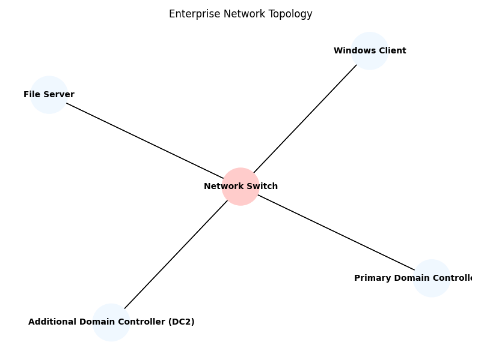

# 🏢 Enterprise Active Directory Infrastructure Lab

## 📌 Project Overview

This project simulates a real‑world enterprise IT environment using **Windows Server 2022**.  
It walks through deploying a two‑tier Active Directory infrastructure, integrating DNS and DHCP, implementing an organizational unit (OU) hierarchy and Group Policy Objects (GPOs), configuring a file server with appropriate NTFS and share permissions, and joining a Windows 10 client to the domain.  
The lab environment provides hands‑on practice with AD administration and demonstrates how different Windows services work together to deliver a scalable and secure enterprise network.

---

## 🎯 Objectives

- Deploy **Active Directory Domain Services (AD DS)** on a primary domain controller (DC1).  
- Add an **additional domain controller (DC2)** for redundancy and replication.  
- Configure **DNS** and **DHCP** roles to provide name resolution and automated IP addressing【625699008318383†L438-L480】.  
- Design an **organizational unit** (OU) structure for **HR**, **IT** and **Finance** departments【791934392047309†L45-L56】.  
- Create and link **Group Policy Objects (GPOs)** to enforce security settings and folder redirection【126904375430747†L71-L97】.  
- Configure a **file server** with shared folders and proper NTFS/share permissions【83614535428773†L572-L627】.  
- Join a Windows 10 client to the domain and verify authentication and policy application.

---

## 🖥 Lab Environment

- **Hyper‑V virtualization** platform (or any virtualization of your choice).  
- **Windows Server 2022** – two virtual machines acting as DC1 and DC2.  
- **Windows Server 2022** – one VM configured as a **File Server**.  
- **Windows 10** – one VM representing the **client** workstation.  
- The servers use **static IP addresses** and are connected to the same virtual network.  
- DNS and DHCP roles are integrated on the primary domain controller to simplify name resolution and address assignment【625699008318383†L438-L480】.

---

## 🗺 Network Topology

Below is the high‑level topology of the lab.  DC1 is the primary domain controller and hosts DNS/DHCP.  DC2 is a second domain controller that replicates the AD database.  The file server provides shared storage, and a Windows 10 client is joined to the domain.

---

## ⚙ Implementation Steps

1. **Install Windows Server 2022 and set static IPs**.  After installing the OS, rename each server and configure a static IP; a fixed IP is essential for services like DNS and AD DS【932202218295430†L178-L193】.
2. **Install AD DS role on DC1**.  Open *Server Manager* → **Manage** → **Add Roles and Features**, choose **Role‑based or feature‑based installation**, select the server, and tick **Active Directory Domain Services**.  Accept any required features and complete the wizard【932202218295430†L233-L279】.
3. **Promote DC1 to a domain controller**.  In *Server Manager*, click the yellow notification and select **Promote this server to a domain controller**.  Choose **Add a new forest** and specify the root domain name, keep default options, set the Directory Services Restore Mode (DSRM) password, and complete the wizard【932202218295430†L331-L432】.
4. **Install DNS and DHCP roles**.  In *Server Manager*, install the **DNS Server** (added automatically with AD DS) and **DHCP Server** roles.  Authorize the DHCP server and configure a scope with a valid IP range, subnet mask, default gateway and DNS server settings【625699008318383†L576-L621】.  This enables automatic IP assignment for clients.
5. **Add DC2 as an additional domain controller**.  Join the second server to the domain and install the AD DS role as before.  When promoting, select **Add a domain controller to an existing domain**, provide domain credentials, set a DSRM password and select a replication partner【280511281745717†L169-L232】.  After installation and reboot, verify replication and adjust DNS settings on both DCs so they point to each other【280511281745717†L236-L255】.
6. **Create Organizational Units (OUs)**.  Launch *Active Directory Users and Computers*, right‑click the domain name and select **New → Organizational Unit**.  Name OUs for **HR**, **IT** and **Finance** to logically organize users and computers【791934392047309†L45-L56】.  Setting up OUs early simplifies delegation and policy assignment.
7. **Configure Group Policy Objects (GPOs)**.  Open *Group Policy Management*, right‑click **Group Policy Objects** and create a new GPO.  Edit it to define password policies, desktop settings or security restrictions.  Link the GPO to the appropriate OU by right‑clicking the OU and selecting **Link an existing GPO**【126904375430747†L71-L97】.  You can create separate GPOs for each department.
8. **Deploy folder redirection** (optional).  On the file server, create a shared folder for user documents, set NTFS and share permissions, then edit a GPO linked to the OU to enable **Folder Redirection** for Documents.  Point the target location to the UNC path (e.g., `\\FileServer\UserDocs`).  See the folder redirection steps in the documentation for detailed instructions【330814559545438†screenshot】.
9. **Configure the file server**.  Choose or create a directory to share (e.g., `E:\share`).  In the folder’s properties, open **Advanced Sharing**, select **Share this folder** and configure share permissions by adding the appropriate domain groups and granting access【83614535428773†L575-L627】.  Then set NTFS permissions on the **Security** tab; assign full control to administrators and appropriate rights to groups such as HR, IT or Finance【83614535428773†L631-L671】.
10. **Join the client to the domain**.  In the Windows 10 client, open **Settings → System → About → Join a domain**, enter the domain name, and provide credentials of a domain user.  After restarting, log in with a domain account and verify that policies apply and access to shared resources works as expected.

---

## 🧪 Verification

- **Authentication** – Confirm that domain users can log on to the client and are authenticated against DC1/DC2.  
- **Group Policy** – Use `gpresult /r` to verify that the expected GPOs are applied to the user and computer objects.  
- **Folder Redirection & Shared Drives** – Check that redirected folders point to the network share and that users have access to their departmental shares on the file server.  
- **Replication & DNS** – Run `repadmin /showrepl` on both domain controllers to ensure replication succeeds【280511281745717†L276-L307】.

---

## 📚 Skills Demonstrated

- Planning and deploying an **Active Directory** forest with multiple domain controllers.  
- Configuring **DNS** and **DHCP** to support enterprise networks【625699008318383†L438-L480】.  
- Designing **OU structures** and applying **Group Policies** tailored to departments【791934392047309†L45-L56】【126904375430747†L71-L97】.  
- Implementing **file sharing** with proper NTFS and share permissions【83614535428773†L575-L627】【83614535428773†L631-L671】.  
- Performing **folder redirection** and verifying policy enforcement【330814559545438†screenshot】.  
- Joining clients to the domain and troubleshooting connectivity and policy issues.
